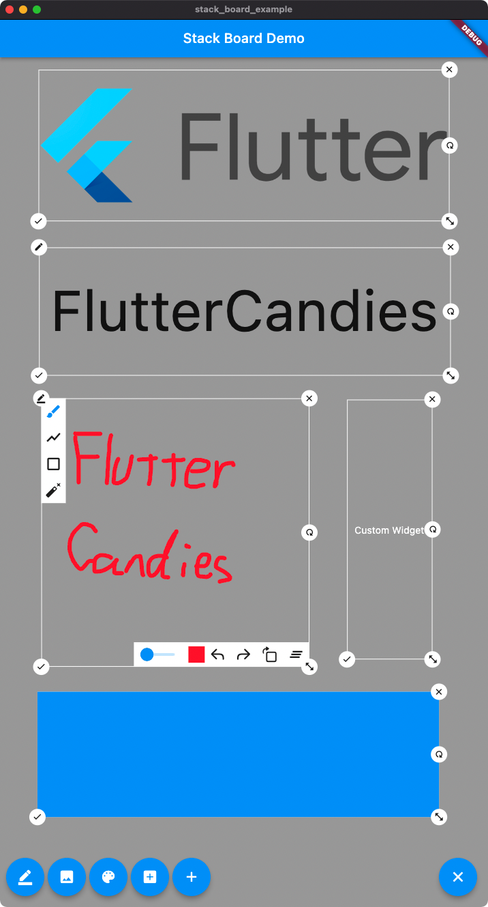

# stack_board

A Flutter package of custom stack board.


## 1.使用 StackBoardController
```dart
import 'package:stack_board/stack_board.dart';

StackBoard(
    controller: _boardController,
    ///添加背景
    background: const ColoredBox(color: Colors.grey),
),
```
添加自适应图片
```dart
_boardController.add(
    const AdaptiveImage(
        'https://flutter.dev/assets/images/shared/brand/flutter/logo/flutter-lockup.png',
    ),
);
```

添加自适应文本
```dart
_boardController.add(const AdaptiveText('自适应文本'));
```

添加画板
```dart
_boardController.add(const StackDrawing());
```

添加自定义Widget
```dart
_boardController.add(
    StackBoardItem(
        child: const Text('Custom Widget', style: TextStyle(color: Colors.white)),
    ),
);
```

### 添加自定义item
1.继承自StackBoardItem
```dart
///自定义类型 Custom item type
class CustomItem extends StackBoardItem {
  const CustomItem({
    Future<bool> Function()? onDel,
    int? id, // <==== must
  }) : super(
          child: const Text('CustomItem'),
          onDel: onDel,
          id: id, // <==== must
        );

  @override // <==== must
  CustomItem copyWith({
    CaseStyle? caseStyle,
    Widget? child,
    int? id,
    Future<bool> Function()? onDel,
    dynamic Function(bool)? onEdit,
  }) =>
      CustomItem(onDel: onDel, id: id);
}
```
2.使用controller添加
```dart
_boardController.add<CustomItem>(const CustomItem());
```
3.使用customBuilder构建
```dart
StackBoard(
    controller: _boardController,
    ///如果使用了继承于StackBoardItem的自定义item
    ///使用这个接口进行重构
    customBuilder: (StackBoardItem t) {
        if (t is CustomItem) {
            return ItemCase(
                key: Key('CustomStackItem${t.id}'), // <==== must
                isCenter: false,
                onDel: () async => _boardController.remove(t.id),
                child: Container(width: 100, height: 100, color: Colors.blue),
            );
        }
    },
)
```
## 2.使用ItemCase进行完全自定义
```dart
Stack(
    children: <Widget>[
        ItemCase(
            isCenter: false,
            child: const Text('Custom case'),
            onDel: () async {},
            onEdit: (bool isEditing) {},
            onOffsetChanged: (Offset offset) {},
            onSizeChanged: (Size size) {},
        ),
    ],
)
```

## 效果预览

预览网址:[https://stack.liugl.cn](https://stack.liugl.cn)



